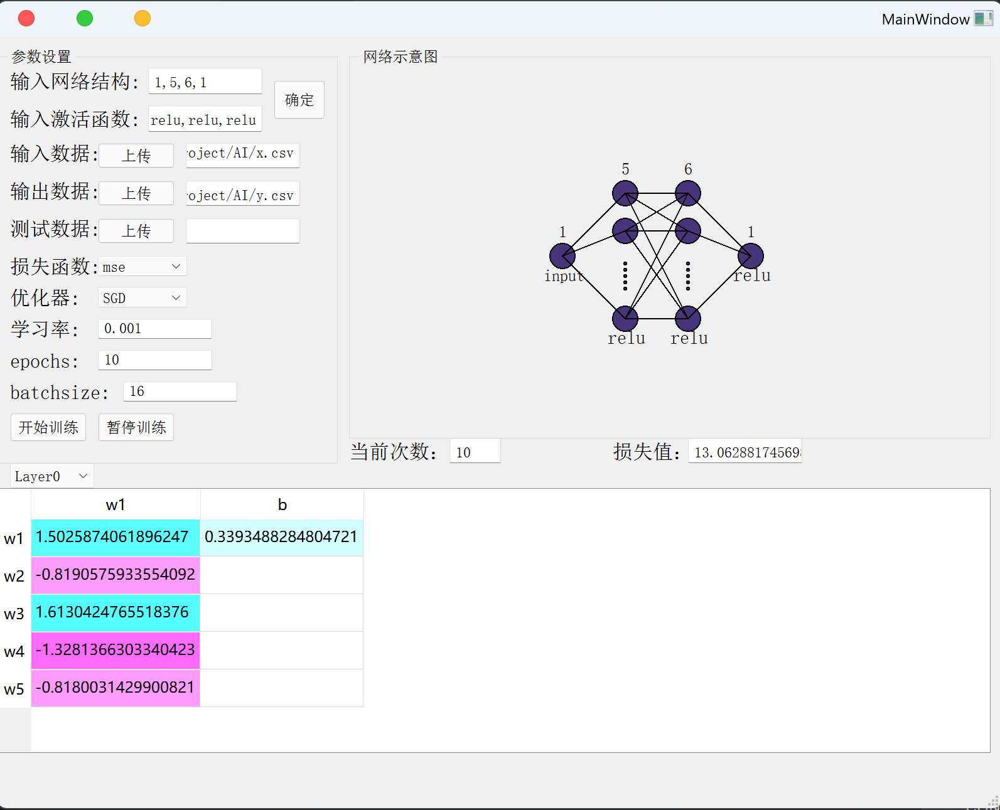

# 简介
这是我在上海理工大学机器学习课程上平时作业做的东西，可以用来可视化神经网络训练的整个流程。

# 💡 特色

1，可以实现神经元参数的可视化，包括实时显示权重和偏置的值。

2，可以中途暂停训练，然后自定义修改神经元参数的值，修改的神经元参数的值会自动进入下一次迭代训练。

3，可以实现自定义的激活函数，损失函数，优化器，以及自定义的神经网络结构（目前版本仅支持全连接神经网络）。

4，可以绘图显示损失值的变化情况，以及各个神经元参数值的变化情况。

# 🚀 快速上手

1，首先安装需要的python环境依赖

`pip install -r requirements.txt`

2，然后运行`run.py`文件

`python run.py`

3，根据提示输入神经网络的参数，然后开始训练。

# 📦 目录结构

项目中的主要文件和功能如下：

`run.py`：程序的入口文件，运行这个文件即可开始训练。

`calculate.py`：定义了神经网络的计算过程，包括前向传播，反向传播，激活函数，损失函数以及训练的整个流程。

`UI.py`：定义了程序的UI界面，包括神经元参数的可视化，损失值的可视化，以及训练的控制按钮。

`untitled.ui`：UI界面的设计文件，使用`Qt Designer`设计，可以自定义修改按钮的组件布局。

`requirements.txt`：项目的依赖文件，运行`pip install -r requirements.txt`即可安装所有的依赖。

`tool.py`：将.ui文件转换为.py文件的工具文件，使用方法见文件注释。

# 📝 许可证

本项目使用 MIT 许可证，点击 [LICENSE](LICENSE) 查看详情。

# 📚 说明

这是我的课程学习记录，加上我本人能力有限，代码中可能存在一些问题，并且只能够实现最简单的神经网络的计算。随着我后期不断深度的学习，我会不断地完善这个项目，使其能够实现更多的功能。

如果你对这个项目感兴趣，欢迎 `star` 这个项目，也欢迎提交 `issue` 和 `pull request`，帮助这个项目变得更好。

